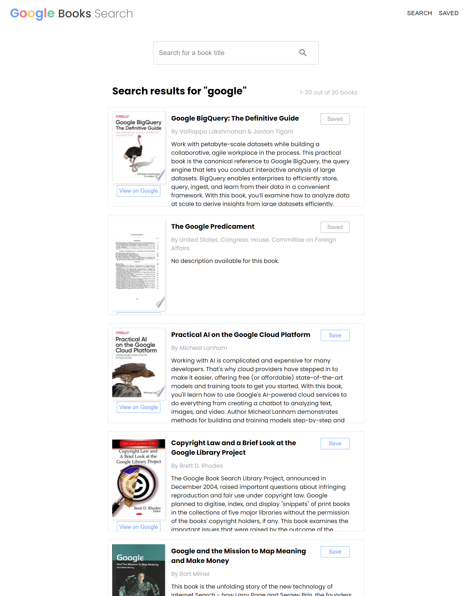
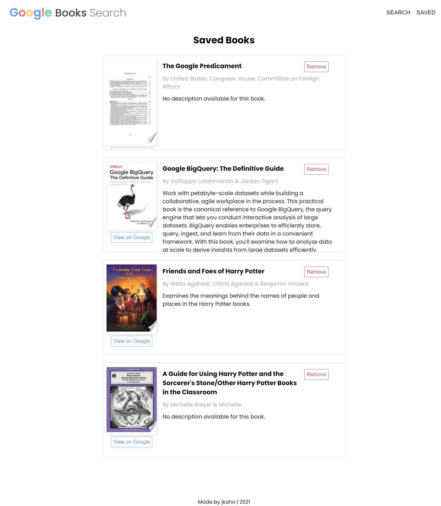

# Google Books Search 

## Description 

*Google Books Search* is, as its name suggests, an application for searching books! Users may also save books of interest.

## Instructions 

1. Enter a book title or title keyword into the searchbar to display a list of search results (with basic book info).
2. Click the *View on Google* button of a particular book to be taken to the Google Books preview page of that book. 
3. Click the *Save* button of a book to save it to your 'Saved' page for future reference.

## Technologies Used

- React
- JSX
- React Router
- JavaScript
- Node.js
- Express 
- MongoDB / Mongoose 
- MongoDB Atlas
- Google Books API
- Material Design
- Google Fonts
- Heroku

## Screenshots 

### Search page 

### Saved books page 

## Link

Link to deployed application: [jkaho-google-books.herokuapp.com/](https://jkaho-google-books.herokuapp.com/)

## Questions 

**My GitHub Profile:** [jkaho](https://www.github.com/jkaho)

If you have any further questions, feel free to email me at [j.h_7@yahoo.com](mailto:j.h_7@yahoo.com)